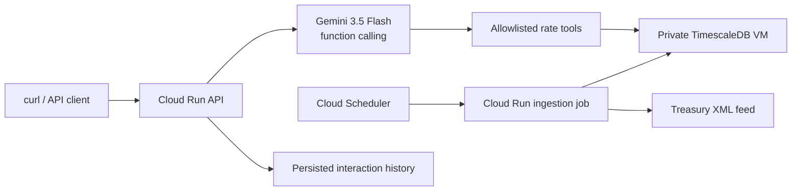

# MoFiAgent

MoFiAgent is a small agentic service that answers plain-language questions about official U.S. Treasury yields. Gemini selects from typed tools; application code validates every argument, runs parameterized time-series queries in TimescaleDB, and returns the exact observations to Gemini for a concise answer.



The numerical path is deliberately not vector RAG. Latest values, historical values, changes, and curve spreads require exact dated SQL. A document-vector layer would only be useful later for qualitative policy documents.

## Local development

Prerequisites: Python 3.12 or 3.13, Docker with Compose, Terraform 1.14+, and the Google Cloud CLI.

```bash
python3 -m venv .venv
.venv/bin/python -m pip install uv==0.12.3
make install
make check
```

`make check` starts the pinned local TimescaleDB image, applies immutable migrations, and runs formatting, linting, strict type checks, unit tests, integration tests, and the 85% coverage gate.

Load the current official Treasury feed:

```bash
make ingest
```

To run the API locally, copy `.env.example` to `.env`, set the Google Cloud project, and ensure ADC is configured:

```bash
/Users/kennyclaka/google-cloud-sdk/bin/gcloud auth application-default login
make serve
```

Then submit a question:

```bash
curl --fail-with-body \
  --header 'Content-Type: application/json' \
  --data '{"question":"What is the latest 10-year Treasury yield?"}' \
  http://localhost:8080/v1/questions
```

## Key guarantees

- The model cannot issue SQL or invent tool names; Pydantic validates allowlisted tools and Treasury tenors.
- Agent execution is bounded to four rounds and eight total tool calls.
- Questions, answers, tool metadata, status, latency, source URLs, and data dates are persisted.
- Only the question and health routes are public. There is no public history endpoint.
- The Cloud Run API is capped at two instances with concurrency eight and a 30-second request timeout.
- TimescaleDB has no public IP and only accepts PostgreSQL traffic from a dedicated `/26` serverless subnet.
- Database credentials are generated ephemerally and written to Secret Manager without entering Terraform plan or state.
- The database disk has deletion protection and daily snapshots retained for 30 days.
- Application, TimescaleDB, Python, uv, and Terraform provider versions are locked or digest-pinned.

## Documentation

- [Implementation plan](IMPLEMENTATION_PLAN.md)
- [Architecture decision log](docs/DECISIONS.md)
- [Deployment and operations runbook](docs/OPERATIONS.md)
