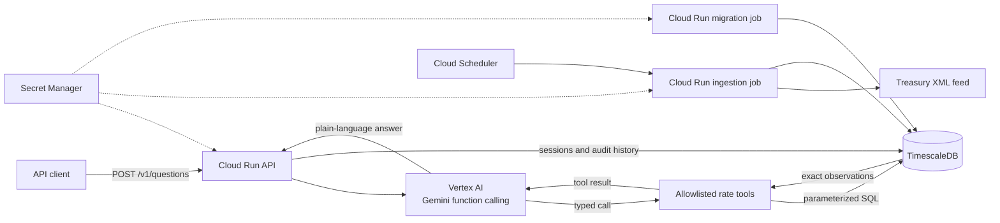

# MoFiAgent

I built MoFiAgent as a small, deployed agentic service that answers plain-language questions about official U.S. Treasury yields. Gemini decides which typed rate tool to call; application code validates the call, runs an exact TimescaleDB query, and gives the resulting observations back to Gemini for a concise, sourced answer.

My goal was to keep the service narrow enough to trust and operate, rather than build a broad chatbot. It supports latest and historical yields, changes between dates, yield-curve spreads, and contextual follow-up questions. I do not let the model write SQL or answer a rate from its own memory.

The prompt only required answering individual questions; multi-turn conversation was an extension I chose to add because rate questions naturally lead to follow-ups such as “what was that yield yesterday?” Because the demo endpoint is intentionally public and unauthenticated, I capped each conversation at five questions. That limit preserves useful context while bounding model spend, stored history, and one avenue for abuse.

## Try the deployed service

The API is deployed at `https://mofiagent-api-hy3l6ihkeq-ue.a.run.app`.

Start a conversation by omitting `session_id`:

```bash
curl --fail-with-body \
  --request POST \
  --header 'Content-Type: application/json' \
  --data '{"question":"What is the latest 10-year Treasury yield?"}' \
  https://mofiagent-api-hy3l6ihkeq-ue.a.run.app/v1/questions
```

The response includes the grounded answer and a new session identifier:

```json
{
  "id": "<interaction UUID>",
  "session_id": "<session UUID>",
  "turn_number": 1,
  "session_status": "active",
  "next_session_id": null,
  "session_restarted": false,
  "question": "What is the latest 10-year Treasury yield?",
  "answer": "<plain-language answer>",
  "data_as_of": "<observation date>",
  "source": {
    "name": "U.S. Department of the Treasury",
    "url": "<Treasury source URL>"
  }
}
```

Pass that `session_id` with a follow-up so the model can resolve references such as “that yield”:

```bash
curl --fail-with-body \
  --request POST \
  --header 'Content-Type: application/json' \
  --data '{
    "session_id":"<session UUID>",
    "question":"How did that compare with the 2-year yield?"
  }' \
  https://mofiagent-api-hy3l6ihkeq-ue.a.run.app/v1/questions
```

A session accepts five total questions. The fifth response has `session_status: "closed"` and supplies `next_session_id`. If a client submits the old closed ID again, the service automatically moves the request to the empty successor session and returns `session_restarted: true`. I chose this cap as a lightweight abuse and cost control for an unauthenticated take-home API; it limits how much context any one session can accumulate without making the client coordinate a separate session-creation request.

The only other public route is the process health check:

```bash
curl --fail https://mofiagent-api-hy3l6ihkeq-ue.a.run.app/health
```

## Supported questions

MoFiAgent currently covers nominal Treasury tenors of 1, 1.5, 2, 3, 4, and 6 months and 1, 2, 3, 5, 7, 10, 20, and 30 years. Example questions include:

- “What is the latest 10-year Treasury yield?”
- “What was the 2-year yield on January 2, 2026?”
- “How many basis points did the 10-year change between August 11 and August 12, 2026?”
- “What was the 2s10s spread on August 12, 2026?”
- “What was that longer yield the previous day?”

For a weekend, holiday, or other date without an observation, the historical tool returns the latest prior observation and the answer is required to say so. A new environment contains only the years that have been explicitly ingested; the scheduled job refreshes the current UTC calendar year.

## Architecture



### Request lifecycle

1. FastAPI validates a 3–500 character question and an optional UUID session ID.
2. A transaction in TimescaleDB creates or locks the session, allocates the next turn, and prevents concurrent requests from corrupting its ordering.
3. Up to four prior question/answer pairs are rebuilt as Gemini chat history.
4. Gemini may select one or more of four function tools: latest rate, historical rate, date comparison, or curve spread.
5. Pydantic rejects unknown fields, unsupported tenors, invalid dates, and invented tool names before a query runs.
6. Repository code executes parameterized SQL and returns exact `Decimal` values, dates, and the authoritative source URL.
7. Gemini writes the human-readable response from those tool results. The service records the answer, tool metadata, latency, status, data date, and source URL atomically with the completed turn.
8. Turn five closes the session and creates its empty successor in the same transaction.

The agent is bounded to four model/tool rounds and eight tool calls per request. If no rate tool succeeds, it returns a fixed scope message instead of treating ungrounded model text as an answer.

## Infrastructure on Google Cloud

I described the entire deployed stack with Terraform. Application compute is in `us-east1`; Gemini uses Vertex AI's `us` multi-region endpoint.

| Component | Responsibility | Reason for the choice |
|---|---|---|
| Cloud Run service | Stateless HTTPS API | Managed TLS, revisions, scale-to-zero, and a small operational surface for a low-traffic take-home service |
| Vertex AI Gemini | Intent interpretation, tool selection, and response wording | Provides native function calling while Google IAM service identity avoids shipping an API key |
| Cloud Run jobs | Schema migrations and Treasury ingestion | Keeps administrative and scheduled work out of the request-serving process and gives each job its own identity |
| Cloud Scheduler | Runs ingestion daily at 02:00 UTC | Simple, observable trigger with bounded retries and no continuously running worker |
| TimescaleDB on a Compute Engine VM | Rate observations, ingestion runs, conversations, and interaction history | Adds a purpose-built time-series layer while retaining PostgreSQL transactions for session state and audit history |
| Separate persistent disk | Durable PostgreSQL data | The database disk survives boot-disk or VM replacement and is protected from accidental Terraform destruction |
| Daily disk snapshots | Recovery copies retained for 30 days | Appropriate baseline recovery for the take-home scope; not a substitute for tested point-in-time recovery |
| Custom VPC and Direct VPC egress | Private Cloud Run-to-database path | The database has no public IP and port 5432 is admitted only from the dedicated serverless subnet |
| Cloud NAT | Outbound access for the private VM | Lets the database VM pull its pinned container and reach Google APIs without public inbound exposure |
| Secret Manager | Separate admin, API, and ingestion DSNs | Runtime identities see only the credential they require; generated password values use write-only Terraform attributes |
| Dedicated service and database accounts | API, migration, ingestion, scheduler, and VM isolation | Limits blast radius: only the API identity can call Vertex AI, and only migration receives the database administrator DSN |
| Artifact Registry and Cloud Build | Immutable application releases | Every deployed image is digest-pinned; the registry rejects tag mutation |
| Versioned GCS state backend | Main Terraform state | Provides durable, versioned state without committing credentials or state files to Git |

Cloud Run uses [Direct VPC egress](https://docs.cloud.google.com/run/docs/configuring/vpc-direct-vpc) with a `/26` serverless subnet, the minimum size Google documents for its block allocation model. The API is capped at two instances with concurrency eight, a four-connection pool per instance, and a 30-second platform timeout. Those limits intentionally protect the single small database VM and constrain surprise cost.

The VM uses Container-Optimized OS, Shielded VM features, OS Login, IAP-only SSH ingress, automatic restart, and a digest-pinned TimescaleDB image. The database data disk has `prevent_destroy`; the VM also has deletion protection. Removing either requires an explicit, reviewed two-phase change.

## Why these choices

### A bounded agent instead of a deterministic question parser

I chose a bounded tool-calling agent rather than a deterministic question parser. A parser could handle a few hard-coded examples more cheaply, but it becomes brittle around phrasing and contextual follow-ups. Letting Gemini choose from a small tool surface demonstrates actual agent behavior while keeping the numerical work deterministic. The model decides what information it needs; it never controls SQL, credentials, infrastructure, or arbitrary code.

The trade-off is extra latency, model cost, and nondeterminism. Tool-call and round budgets, strict schemas, fixed unsupported behavior, and persisted audit data bound those risks. A production version would add an evaluation suite before changing prompts or model versions.

### Exact SQL instead of vector RAG for rate observations

I deliberately did not use vector RAG for rate observations. Vector retrieval is a poor primary index for exact time-series questions: nearest-neighbor similarity does not guarantee the correct tenor, business date, revision, ordering, or basis-point arithmetic. It would add embedding and retrieval failure modes without improving queries that SQL already expresses precisely.

TimescaleDB stores rates as numeric observations keyed by date, series, and tenor. Comparisons and spreads operate on `Decimal` values in application code after exact indexed lookups. Gemini only explains the returned results.

RAG would be valuable in a later hybrid system for qualitative material such as Federal Reserve statements, Treasury methodology, or policy documents. In that design, document retrieval would support narrative questions while typed SQL tools would remain authoritative for every number.

### Treasury as the source instead of FRED

I chose the [U.S. Treasury daily yield curve feed](https://home.treasury.gov/resource-center/data-chart-center/interest-rates/TextView) because it is the primary public source and requires no API key. That reduces secret handling and avoids an intermediary for this narrow data set. Ingestion validates a maximum response size, parses untrusted XML with `defusedxml`, validates dates and decimal values, and idempotently upserts observations.

The trade-off is a less convenient XML contract and year-oriented backfills. FRED would offer a broader catalog and a simpler expansion path, but it would introduce an API key and would still need careful series-to-tenor mapping.

### TimescaleDB on Compute Engine

TimescaleDB was an architectural choice, not a requirement of the take-home prompt. I selected it because rates are naturally time-series data, while its PostgreSQL foundation also supports transactional session state and audit history. The current `rate_observations` hypertable provides indexed date/tenor lookups and leaves a clear path to features such as continuous aggregates, retention policies, and a larger collection of rate series. Keeping both workloads in one database also makes session completion plus history insertion atomic and keeps the take-home architecture understandable.

At the current data volume, ordinary PostgreSQL with a composite index would be entirely sufficient, so TimescaleDB is a forward-looking choice rather than a present performance necessity. Its largest cost is operational ownership: this design has one database VM in one zone, no automatic database failover, no point-in-time recovery, and requires the operator to own patching and upgrades. Cloud SQL would remove much of that burden, but Google only permits extensions on its supported list and [TimescaleDB is not currently listed](https://docs.cloud.google.com/sql/docs/postgres/extensions). Once I chose TimescaleDB, a protected private VM was the clearest way to run it within GCP for this scope.

### TimescaleDB-backed conversations instead of process memory

Multi-turn conversation was not required by the prompt. I added it because contextual follow-ups are a natural part of asking about rates, then deliberately stopped at five questions per session. The cap is defense in depth for a public endpoint: it bounds context growth, model cost, persisted history, and repeated use of a leaked session ID. It is not a replacement for authentication, per-caller quotas, or edge rate limiting, which remain V2 work.

Once I chose to support follow-ups, I used durable conversation state rather than relying on the chat object's process memory. The Google Gen AI SDK can construct a chat from prior messages, but a Cloud Run instance can disappear or another instance can receive the next request. Process-local chat state therefore cannot be the system of record. MoFiAgent persists completed exchanges and reconstructs a short Gemini history on every request.

[Vertex AI Agent Engine Sessions](https://docs.cloud.google.com/vertex-ai/generative-ai/docs/agent-engine/sessions/manage-sessions-api) can manage session events, and Memory Bank can provide longer-lived semantic memory. Agent Engine Sessions currently use a `v1beta1` API, and Memory Bank is a preview feature. For a five-turn conversation already tied to transactional audit records, a small TimescaleDB state machine was easier to reason about, test, and deploy without adding another control plane.

The trade-off is owning session locking, expiry, and retention. The implementation uses a single in-flight lease, row locking, a unique session/turn constraint, and an atomic rollover after turn five. It does not yet bind a session to an authenticated user, so I describe the five-turn limit as risk reduction rather than complete abuse prevention.

### Python instead of Go

I chose Python for implementation speed and the maturity of FastAPI, Pydantic, psycopg, and Google's Gen AI SDK. It keeps tool schemas and API validation concise, which matters more here than raw request throughput because network and model inference dominate latency.

Go would produce a smaller runtime footprint, faster startup, and stronger compile-time guarantees. For this traffic level those benefits do not offset slower iteration. Strict Pyright, Ruff, frozen Pydantic models, a locked dependency graph, and an 85% coverage gate compensate for much of Python's dynamism.

### Cloud Run instead of GKE

I chose Cloud Run because it fits a single stateless HTTP container and two short-lived jobs without introducing cluster operations. It scales the API to zero and uses service identities natively.

The trade-offs are cold starts, ephemeral instances, and less control over placement and connection lifetime. Startup probes, bounded database pools, durable session state, retry-capable connections, and conservative scaling make those constraints explicit. GKE would only be justified if V2 required long-running agent workers, custom networking, or substantially more services.

### Two Terraform stacks and immutable releases

I split the infrastructure into two Terraform stacks. `infra/bootstrap` creates the resources needed to hold the rest of the deployment: the Artifact Registry repository, required build APIs, and versioned GCS state bucket. `infra/main` then uses that bucket as its backend and owns all runtime infrastructure. This separation resolves the backend bootstrapping dependency and keeps the main state remote.

Images and the TimescaleDB base are pinned by SHA-256 digest. Terraform refuses a mutable application image reference. Database migrations are immutable, checksummed, serialized with a PostgreSQL advisory lock, and run as a separate job with the admin role. A `migration_image` override allows an additive migration to run before the API changes to the new image.

The bootstrap stack currently retains local Terraform state because it creates the remote state bucket itself. That state must be protected by the operator. In a larger organization, the state bucket and Artifact Registry would normally come from a separately administered platform bootstrap or organization-level stack.

## How I used GenAI to move quickly

I used a GenAI coding assistant throughout the project to compress research and implementation time. I treated it as a fast collaborator, not as the decision-maker or source of truth. This distinction matters because the assistant can generate a plausible architecture quickly, but plausibility is not the same as suitability.

A concrete example was persistence. Early in the design exploration, before I finalized GCP as the cloud provider, the assistant suggested DynamoDB. That would have been a reasonable serverless store for conversation records, but it did not fit the center of gravity of this service. The primary data is an exact, ordered time series, and the important operations are date/tenor lookups, comparisons, spreads, ingestion upserts, and transactional conversation history. Using DynamoDB would either force those access patterns into a less natural key design or introduce a second database beside the rate store.

I rejected that initial direction and chose TimescaleDB. It gave me PostgreSQL's relational and transactional model for sessions and audit history, plus a time-series hypertable for rates. That decision also created a real trade-off—running TimescaleDB on GCP meant owning a database VM because Cloud SQL does not support the extension. I accepted that cost for this take-home, protected the VM and data disk, documented the single-zone limitation, and made reevaluating standard managed PostgreSQL an explicit V2 decision.

GenAI accelerated the work in four main areas:

- **Exploration:** generating candidate architectures and surfacing questions I needed to answer, such as SQL versus vector retrieval, Cloud Run versus GKE, and custom sessions versus Vertex AI Agent Engine Sessions.
- **Research:** locating relevant official documentation and comparing service constraints. I verified claims against primary Google Cloud and library documentation before incorporating them.
- **Implementation:** producing initial Python, SQL, Terraform, and test scaffolding, then iterating as I imposed the domain model, least-privilege boundaries, failure behavior, and deployment sequence.
- **Review and verification:** identifying edge cases and helping automate checks. I still inspected Terraform plans, ran migrations before application rollout, executed the test suite, queried the deployed database, and exercised a real five-turn conversation and rollover.

My main contribution was judgment: understanding the problem well enough to choose the right tools, challenge suggestions that did not fit, define the safety boundaries, and decide what was acceptable within the time box. GenAI reduced the cost of typing, research, and iteration; I remained accountable for the architecture and for proving that the deployed system behaved as intended.

## Run locally

### Prerequisites

- Python 3.12 or 3.13
- Docker with Docker Compose
- Google Cloud CLI
- A Google Cloud project with billing and Vertex AI enabled
- Application Default Credentials with permission to use Vertex AI

Terraform is not required for local development.

### Install and test

```bash
git clone https://github.com/kclaka/MoFiAgent.git
cd MoFiAgent

python3 -m venv .venv
.venv/bin/python -m pip install uv==0.12.3
make install
make check
```

`make check` starts the digest-pinned TimescaleDB container, applies every migration, and runs Ruff formatting/lint checks, strict Pyright, unit tests, integration tests, and the 85% branch-coverage gate. Dependencies are installed from the committed `uv.lock` with `--frozen`.

### Configure the service

```bash
cp .env.example .env
gcloud auth application-default login
gcloud config set project YOUR_PROJECT_ID
```

Set `MOFI_GOOGLE_CLOUD_PROJECT=YOUR_PROJECT_ID` in `.env`. The local database DSN in the example already matches `compose.yaml`.

If you did not run `make check`, initialize the database explicitly:

```bash
make db-up
make migrate
```

Load the current UTC year of official Treasury data and start the API:

```bash
make ingest
make serve
```

The local API listens on `http://localhost:8080`. In a second terminal:

```bash
curl --fail-with-body \
  --header 'Content-Type: application/json' \
  --data '{"question":"What is the latest 10-year Treasury yield?"}' \
  http://localhost:8080/v1/questions
```

To backfill another year, keep the local database running and use the CLI directly:

```bash
env PYTHONPATH=src .venv/bin/python -m mofiagent ingest --year 2025
```

Stop the local database when finished:

```bash
make db-down
```

## Deploy to a new Google Cloud project

These instructions assume an existing, billing-enabled project and an operator with permission to enable APIs, manage IAM, build containers, and create the resources in the Terraform configuration. They use Terraform 1.14+, the Google Cloud CLI, and Application Default Credentials.

### 1. Authenticate and select the project

```bash
gcloud auth login
gcloud auth application-default login
gcloud config set project YOUR_PROJECT_ID
```

### 2. Bootstrap Artifact Registry and Terraform state

Copy the example variables and choose a globally unique bucket name:

```bash
cp infra/bootstrap/terraform.tfvars.example infra/bootstrap/terraform.tfvars
terraform -chdir=infra/bootstrap init
terraform -chdir=infra/bootstrap fmt -check
terraform -chdir=infra/bootstrap validate
terraform -chdir=infra/bootstrap plan -out=bootstrap.tfplan
terraform -chdir=infra/bootstrap apply bootstrap.tfplan
```

Edit `infra/bootstrap/terraform.tfvars` before planning. Do not commit that file or `infra/bootstrap/terraform.tfstate`; both are ignored. Preserve the bootstrap state securely because it owns the state bucket and immutable Artifact Registry repository.

### 3. Build the first immutable image

```bash
gcloud builds submit \
  --project YOUR_PROJECT_ID \
  --config cloudbuild.yaml \
  --substitutions _REGION=us-east1,_REPOSITORY=mofiagent \
  .

gcloud artifacts docker images list \
  us-east1-docker.pkg.dev/YOUR_PROJECT_ID/mofiagent/mofiagent \
  --include-tags
```

Copy the resulting `sha256:...` digest. The value used by Terraform must have this form:

```text
us-east1-docker.pkg.dev/YOUR_PROJECT_ID/mofiagent/mofiagent@sha256:<64 hex characters>
```

### 4. Configure and apply the main stack

```bash
cp infra/main/backend.hcl.example infra/main/backend.hcl
cp infra/main/terraform.tfvars.example infra/main/terraform.tfvars
```

Set the bucket in `backend.hcl`; set `project_id` and the digest-pinned `application_image` in `terraform.tfvars`. Then initialize and review the plan:

```bash
terraform -chdir=infra/main init -backend-config=backend.hcl
terraform -chdir=infra/main fmt -check
terraform -chdir=infra/main validate
terraform -chdir=infra/main plan -out=initial.tfplan
terraform -chdir=infra/main apply initial.tfplan
```

The default database deletion protection and disk `prevent_destroy` are intentional. Do not disable them merely to make an apply succeed; investigate any replacement plan first.

### 5. Apply the schema and load data

```bash
gcloud run jobs execute mofiagent-migrate \
  --project YOUR_PROJECT_ID \
  --region us-east1 \
  --wait

gcloud run jobs execute mofiagent-ingest \
  --project YOUR_PROJECT_ID \
  --region us-east1 \
  --wait
```

Retrieve the API URL and test it:

```bash
terraform -chdir=infra/main output -raw api_url
```

### Deploy a later release safely

Schema and application rollouts are intentionally two-phase:

1. Build a new image and record its digest.
2. Leave `application_image` on the currently serving digest and set `migration_image` to the new digest.
3. Run `terraform plan`, verify that only the migration job changes, apply it, and execute `mofiagent-migrate --wait`.
4. Set `application_image` to the new digest and remove the `migration_image` override.
5. Plan again, confirm only the API and ingestion workloads change, apply, and run one manual ingestion execution.
6. Smoke-test `/health`, a new question, a contextual follow-up, and the fifth-turn rollover. Finish with a no-change Terraform plan.

This expand-before-contract sequence prevents new code from starting before its additive schema exists. Destructive or incompatible schema changes would require a longer compatibility window and an explicit data migration plan.

## Operations and security posture

- Ingestion runs daily at 02:00 UTC, upserts the current year's feed, and records success/failure plus row counts in `ingestion_runs`.
- The API, migration job, and ingestion job have separate Google service accounts and separate PostgreSQL roles. Human SSH access is not granted by this stack.
- Cloud Run obtains Google credentials from its assigned service identity; there is no service-account key file in the container.
- PostgreSQL is reachable only at `10.20.1.2` inside the custom VPC. IAP is the only configured SSH ingress path.
- Secret payloads are not exposed in normal Terraform plan output or persisted as ordinary random-password resource attributes.
- The public API exposes no history-listing endpoint. Interaction records remain private in the database.
- Structured API/job logs and the database container's `gcplogs` output go to Cloud Logging. VPC Flow Logs, firewall logs, and NAT error logs are enabled.
- The application image runs as UID/GID 10001 in a two-stage, digest-pinned container with no development dependencies.

This is a secure baseline for a public take-home demo, not a claim of full production hardening. The question endpoint intentionally allows unauthenticated invocation. It has instance and agent budgets but no caller identity, quota, edge rate limiting, abuse detection, or per-user session authorization. PostgreSQL traffic is isolated to a private VPC but currently uses `sslmode=disable`. The health route proves that the process is alive, not that the database, data freshness, and Vertex AI are all ready.

Useful operational commands:

```bash
gcloud run services logs read mofiagent-api \
  --project YOUR_PROJECT_ID \
  --region us-east1 \
  --limit 100

gcloud run jobs executions list \
  --project YOUR_PROJECT_ID \
  --region us-east1 \
  --job mofiagent-ingest

terraform -chdir=infra/main plan -detailed-exitcode
```

## What I would build in V2

The order matters: V2 should first remove operational and security risk, then expand capabilities.

### 1. Put a controlled edge in front of the API

Require caller authentication, bind each session to a user or tenant, and add quotas and rate limits. API Gateway can [manage and secure a Cloud Run backend](https://docs.cloud.google.com/api-gateway/docs/get-started-cloud-run); a larger system might use an external Application Load Balancer plus Cloud Armor. Cloud Run would stop accepting direct unauthenticated traffic. I would also add idempotency keys so client retries cannot consume extra turns.

### 2. Expose the deterministic tools through MCP

After adding caller identity and quotas, I would publish the rate capabilities as a remote Model Context Protocol server so they can be discovered and called by MCP-compatible coding agents and AI clients. I would expose the four deterministic operations—latest rate, historical rate, date comparison, and curve spread—not wrap the existing Gemini agent as one large tool.

```text
Coding agent -> MCP rate tool -> validated application service -> TimescaleDB
```

This avoids an agent-calling-an-agent path that would duplicate reasoning, increase latency and model cost, and make failures harder to attribute. The calling agent would retain responsibility for its own conversation and wording; MoFiAgent would return structured decimal values, observation dates, and source URLs. The existing `/v1/questions` REST interface would remain available for human-facing conversations, including its five-turn limit.

I would implement the MCP endpoint as a thin adapter over the same typed application layer used by the REST API rather than create a second implementation of the financial logic. That gives MCP clients automatic tool discovery while preserving one authoritative implementation of validation, calculations, provenance, and auditing. It would make the service reusable from many coding environments, but not literally every environment: the client must support remote MCP and the selected protocol version.

The current MCP specification supports stateless remote operation, which fits Cloud Run without requiring protocol sessions or sticky routing. I would still keep the MCP server separately deployable so it can have its own service identity, scaling limits, audit labels, and release lifecycle. See the [MCP 2026 specification overview](https://blog.modelcontextprotocol.io/posts/2026-07-28/) and [remote server documentation](https://modelcontextprotocol.io/docs/develop/connect-remote-servers).

Read-only tools can still be abused to consume database and cloud capacity, so I would not launch the remote server with the demo API's current anonymous access. It would require OAuth-based authorization, tokens issued specifically for the MCP resource, per-tool least-privilege scopes, caller quotas, and rate limiting. I would not use an MCP session identifier as proof of identity or pass client tokens through to downstream services, following the [MCP authorization and security guidance](https://modelcontextprotocol.io/docs/tutorials/security/authorization).

### 3. Remove the single-zone database failure domain

There are two honest paths:

- If the roadmap will use TimescaleDB-specific capabilities, run a supported multi-zone TimescaleDB topology with continuous backups, tested restores, automated failover, TLS, upgrade automation, and connection pooling.
- If exact rate history remains the primary need, move to highly available Cloud SQL PostgreSQL and use native partitioning/indexes. The data volume here does not require a specialized time-series engine.

Either path should define recovery-point and recovery-time objectives, add point-in-time recovery, rehearse restoration, and automate credential rotation. Daily disk snapshots alone are insufficient for a production financial-data service.

### 4. Build data quality and backfill workflows

Make year/date ranges first-class Cloud Run job inputs, ingest the full required history, and monitor freshness, missing tenors, duplicate/revised values, and unexpected source-schema changes. Add a second authoritative provider for reconciliation rather than silently switching sources. Expose a readiness check that verifies database connectivity and a freshness threshold.

### 5. Add evaluations and observability for the agent

Create a versioned golden set covering supported phrasing, follow-ups, weekends, holidays, unavailable dates, prompt injection, tool failures, and basis-point calculations. Gate prompt/model releases on answer accuracy, tool selection, latency, and cost. Add trace correlation across model rounds and SQL calls, custom metrics, SLOs, alerts, and token/cost dashboards. Store the exact prompt/model configuration used for each interaction.

### 6. Decide deliberately between custom and managed conversation state

Add session TTLs, retention/deletion policies, explicit session APIs, per-user authorization, and cleanup jobs. Re-evaluate Vertex AI Agent Engine Sessions once its API stability and operating model fit the service. Memory Bank should only be introduced if there is a real need for cross-session user memory; it is unnecessary for five-turn rate questions and raises additional privacy and lifecycle questions.

### 7. Expand into a hybrid rates agent

Add typed tools for SOFR, effective federal funds, TIPS, and selected FRED series, with source-specific schemas and provenance. Add vector RAG only for qualitative documents such as FOMC statements or rate methodology. Numerical claims would still have to come from exact tools, and responses would distinguish observation date, publication date, source, and revision status.

### 8. Harden the delivery pipeline

Run all checks on pull requests, use a dedicated least-privilege Cloud Build service account, generate an SBOM, scan dependencies and images, attest build provenance, and promote one digest through environments. Automate migration-first rollout, smoke tests, canary traffic, rollback, and the final Terraform drift check. Move bootstrap ownership to a separately administered platform stack so no durable infrastructure state depends on one operator's local file.

## Repository map

```text
src/mofiagent/agent/     Gemini gateway, bounded loop, and typed tools
src/mofiagent/api/       FastAPI routes and request/response contracts
src/mofiagent/rates/     Treasury ingestion and exact repositories
src/mofiagent/database.py  Connection pool and immutable migration runner
migrations/              Ordered PostgreSQL/TimescaleDB schema changes
infra/bootstrap/         Artifact Registry and Terraform-state bootstrap
infra/main/              Runtime networking, IAM, compute, jobs, and secrets
tests/unit/              Fast isolated behavior tests
tests/integration/       Real TimescaleDB migrations and repository behavior
```
